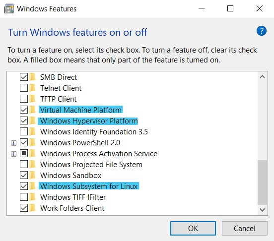

# How to install Ubuntu and WSL Version 2 
## Part 1
- Please follow the instructions line for line carfully:
- before we start the installation part please make sure that you have the latest update for windows 10 in order to make the WSL enviroment to work
- go to your windows search bar and type `system information` to check your OS details and <b> hit ENTER </b>
- look at the Version number as you can see in the image below
 

- if it is lower than 19042 then you need to update, if it's the same number then no need to update the windows, we need this because it's required to make the WSL 2 work without any problems
## How to update windows?
- simply click on this update button <a href="//ms-settings:windowsupdate?activationSource=SMC-IA-4027667">Hi</a>

- Now, we need to enable the required services for your machine.
- go to your windows search bar again and type >> `Turn Windows features on or off` << and hit enter, you should see a list of services ( check the image below )

now scroll down and check the boxes for:
* Virtual Machine Platform
* Windows Hypervisor Platform
* Windows Subsystem for Linux
Note:
if you want to run ubuntu inside a virtual machine ( virtualbox, vmware, etc )
then you need to enable extra services:
*Containers
*Hyper-V 

once you enabled the services click ok and then you are required to restart your machine in order to take effect

Note:
sometimes the virtual machine service is disabled from your machine, if so, then open cmd.exe as adminstator and run this command 
Enable-WindowsOptionalFeature -Online -FeatureName VirtualMachinePlatform
restart your machine after that

now we need to run several commands using PowerShell
search for PowerShell from windows search bar and open PowerShell.exe
run the followind commands
dism.exe /online /enable-feature /featurename:Microsoft-Windows-Subsystem-Linux /all /norestart

then 
dism.exe /online /enable-feature /featurename:Microsoft-Windows-Subsystem-Linux /all /norestart
then

this will enable Virtual Machine Platform for the WSL
dism.exe /online /enable-feature /featurename:VirtualMachinePlatform /all /norestart
 after it finish installing please open the link to download WSL2 update for your windows
https://wslstorestorage.blob.core.windows.net/wslblob/wsl_update_x64.msi
install the downloaded file wsl_update_x64.exe and follow the setup instructions

install windows Terminal from this link
https://www.microsoft.com/en-us/p/windows-terminal/9n0dx20hk701?activetab=pivot:overviewtab

after it's succefully installed open the terminal and run this command to set you enviroment to WSL version 2
wsl --set-default-version 2

now we need to install UBUNTU from this link 
https://www.microsoft.com/en-us/p/ubuntu/9nblggh4msv6?activetab=pivot:overviewtab

